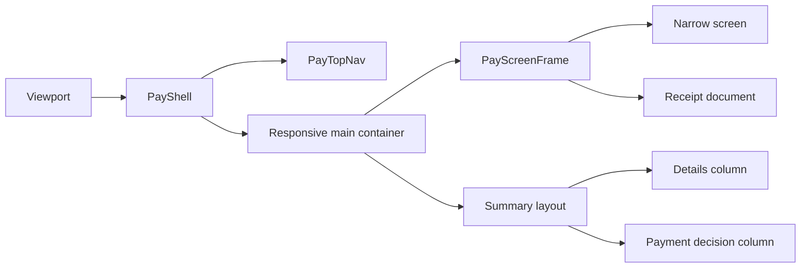

# Design: Responsive Customer Payment Layout

> Status: approved 2026-09-13

การออกแบบนี้ทำให้ customer payment surface ใช้พื้นที่ตามขนาด viewport โดยคง data flow, route และ interaction เดิมไว้ ใช้ Tailwind responsive utilities ที่มีอยู่แล้วและไม่เพิ่ม dependency

## Architecture Overview

### Responsive shell

`PayShell` จะเป็นเจ้าของ outer container ร่วมของทุก payment route

- Mobile ใช้ single-column และ padding `16px`
- Tablet ใช้ single-column กว้างไม่เกิน `720px` และ padding `32px`
- Desktop ใช้ outer container กว้างไม่เกิน `1200px` และ padding `40px`
- `PayTopNav` จะมี inner container ขนาดเดียวกับ shell เพื่อให้ branding อยู่ใน alignment เดียวกัน
- ใช้ breakpoint `md` สำหรับ `768px` และ custom breakpoint `mlg` ที่มีอยู่แล้วสำหรับ `1200px`

สร้าง `PayScreenFrame` เป็น presentational wrapper สำหรับจำกัด readable width ของหน้าจอที่ไม่ควรยืดเต็ม Desktop

- `narrow`: สูงสุด `720px` สำหรับ status, result และ error screens
- `document`: สูงสุด `880px` สำหรับ receipt
- summary ใช้พื้นที่ shell เต็มเพื่อรองรับ two-column layout

### Summary layout

`SummaryScreen` จะแยกเป็นส่วนที่มีอยู่เดิมตามหน้าที่ โดยไม่เปลี่ยนข้อมูลหรือการคำนวณ

- `PayHeroHeader` อยู่ด้านบนและใช้ความกว้างของ summary shell
- detail column เก็บข้อมูลธุรกรรม ตัวแทน ลูกค้า และกรมธรรม์
- payment-decision column เก็บค่าใช้จ่าย ช่องทาง consent ปุ่มชำระเงิน และ security note
- Desktop ใช้ CSS grid `minmax(0, 2fr) minmax(320px, 1fr)` พร้อม `min-w-0` เพื่อให้ column ยุบได้อย่างปลอดภัย
- Mobile และ Tablet กลับเป็นลำดับแนวตั้งเดิม โดย payment-decision อยู่หลัง detail column

### Other screens

Opening, redirecting, processing, success, failed, expired และ invalid ใช้ `PayScreenFrame` แบบ `narrow` เพื่อคงความอ่านง่ายบน Desktop ขณะที่ shell ยังรองรับพื้นที่กว้างขึ้นสำหรับ route ที่ต้องใช้

Receipt ใช้ `PayScreenFrame` แบบ `document` เพื่อให้รายการยาวอ่านง่ายและยังคงลักษณะเอกสาร ใบเสร็จจะจัด action buttons เป็นแถวเดียวตั้งแต่ Tablet ขึ้นไป

### Content wrapping

`PayInfoRow` และจุดแสดง identifier, email, merchant name และ policy document number จะกำหนด flex item ให้ยุบได้และอนุญาตให้ตัดคำที่จำเป็น ค่าที่ dynamic จึงไม่ดัน document ให้กว้างเกิน viewport

## Sequence Diagrams



## Data Models & Interfaces

ไม่มีการเปลี่ยนแปลง `PaySession`, payment-flow logic หรือ route contract

```ts
interface PayScreenFrameProps {
  variant?: "narrow" | "document";
  children: ReactNode;
  className?: string;
}
```

`PayScreenFrame` รับเพียง layout props และไม่ถือ state ส่วน `SummaryScreen` ยังคงใช้ `acceptedTerms` และ `canProceedToPayment` เหมือนเดิม

## Technology Decisions

- ใช้ Tailwind CSS v4 utilities และ breakpoint `md`/`mlg` ที่ประกาศใน `src/app/globals.css`
- ใช้ design tokens เดิม เช่น `bg-grey-200`, `bg-bg-paper`, `text-primary`, `shadow-card` และ `rounded-card`
- ใช้ `cn()` สำหรับรวม className ของ wrapper และหลีกเลี่ยง raw hex หรือ dependency ใหม่
- คง client boundary เฉพาะ component ที่มี `useRouter`, `useSearchParams` หรือ state อยู่แล้ว
- ไม่ใช้ JavaScript ตรวจ viewport เพราะ CSS grid และ responsive utilities เพียงพอ และไม่เพิ่ม hydration risk
- ไม่ทำให้ receipt หรือ status cards ยืดเต็ม `1200px` เพียงเพราะ outer shell กว้างขึ้น

## Error Handling Strategy

- หาก content column มีขนาดไม่พอ CSS จะใช้ `minmax(0, ...)` และ fallback เป็น single-column ตาม breakpoint
- หาก dynamic value ยาว CSS จะ wrap/break ภายใน value column แทนการซ่อนหรือตัดข้อมูล
- หาก route เดิม redirect หรือ action เดิมทำงานอยู่ จะไม่เปลี่ยน logic; การปรับมีเฉพาะ presentation layer
- หาก `?embed=1` ถูกใช้ จะยังซ่อน header ตาม behavior เดิม แต่ main responsive container ยังต้องป้องกัน overflow

## Testing Strategy

### Static verification

- รัน `npx tsc --noEmit` เพื่อตรวจ type safety
- รัน `npm test` เพื่อยืนยัน payment-flow regression
- รัน `npm run lint` และ `npm run build` เพื่อยืนยัน source และ production bundle

### Browser verification

ใช้ production build และ target runtime ตาม browser verification reference แล้วตรวจทุก acceptance viewport

- วัด `document.documentElement.clientWidth` ให้เท่ากับ `375`, `768` และ `1440` ตามลำดับ
- วัด `document.documentElement.scrollWidth <= window.innerWidth` ทุก viewport
- ตรวจ computed layout ของ Summary ว่าเป็น single-column ที่ `768` และ two-column ที่ `1440`
- ตรวจ readable width ของ narrow screens และ receipt ไม่เกินค่าที่กำหนด
- ตรวจว่า receipt actions อยู่แถวเดียวที่ `768` และ `1440`
- กด `Tab` จริงเพื่อตรวจ focus indicator ของ checkbox, buttons และ links
- ตรวจ route/action หลักของ Summary, Processing, Success และ Receipt หลัง hydration

## Requirement Traceability

| Design element | Satisfies |
|---|---|
| `PayShell` responsive outer container | REQ-1.1, REQ-1.2, REQ-2.1, REQ-2.2, REQ-2.3, REQ-2.4 |
| `PayScreenFrame` readable-width variants | REQ-1.2, REQ-4.1, REQ-4.2 |
| `SummaryScreen` detail/payment-decision grid | REQ-3.1, REQ-3.2, REQ-3.3, REQ-3.4, REQ-6.4 |
| `PayInfoRow` safe wrapping rules | REQ-1.3 |
| `PayTopNav` aligned inner container | REQ-5.1, REQ-5.2, REQ-5.3 |
| Receipt responsive actions and preserved print control | REQ-4.3, REQ-4.4 |
| Existing client actions and route components unchanged | REQ-6.1, REQ-6.2, REQ-6.3 |
| Browser overflow and viewport verification | REQ-1.1, REQ-1.2, REQ-2.1, REQ-2.2, REQ-2.3 |
